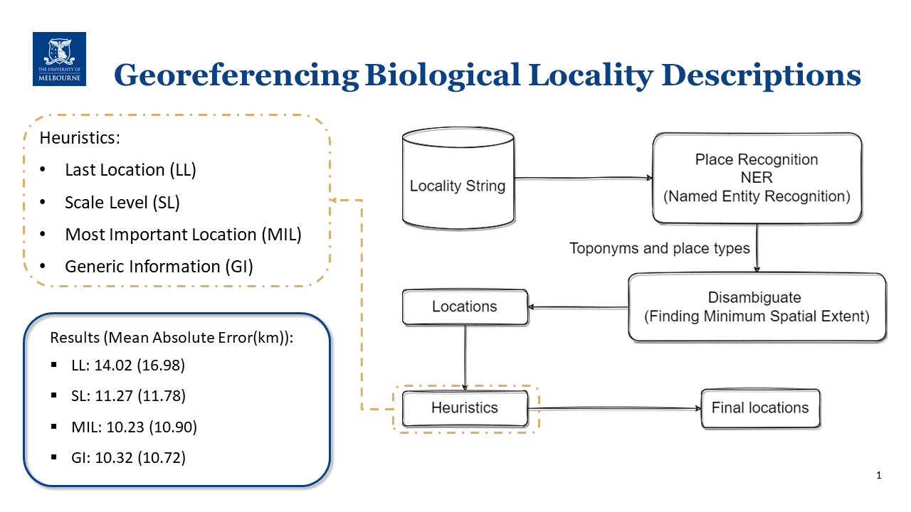

# GeoReferencing Hackathon at Spatial Data Science Symposium
Georeferencing locality descriptions using heuristic approaches. This project was successful in BioGeoRef21 Hackathon at Spatial Data Science Symposium [link](https://geocollaboratory.massey.ac.nz/2021/12/17/biogeoref2021-mini-hackathon-won-by-university-of-melbourne-team/)

Heuristic methods includes are used to find which place name has the most important information inside the descriptions:
- Last/first locations (LL)
- Based on scale and size (SL)
- Linguistically important, based on the structure of the sentence, constituency parsing (MIL)
- Using generic information such as place types (GI)



## Resources:
* Pretrained DL Models for named entity recognition 
* NZ Geographic Board Gazetteer 
* GeoNames dataset 
* OpenStreetMap Nominatim API 

## How to use the code:
Modify the CSV location of the dataset, and run the hackathon code:

````commandline
python hackthon.py
````

## Dependencies
Use the following code to create an environment and install all the dependencies:
```commandline
conda create -n nlp
conda activate nlp
conda update -n base conda
conda install pandas
pip install -U allennlp
pip install -U allennlp-models
pip install spacy
pip install python-Levenshtein
pip install Distance
pip install geopy
pip install pysolr
pip install geopandas
pip install pyproj
pip install anytree

pip install Shapely
pip install geojson
pip install OSMPythonTools
pip install jenkspy
```

## Contributors
- Ehsan Hamzei
- Kamal Akbari
- Kimia Amouzandeh